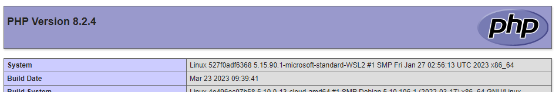

# SymfonyFastTrack

Working through Symfony: The Fast Track (https://symfony.com/doc/6.2/the-fast-track/en/index.html).

## Dependencies / prerequisites

- Docker installed (from https://www.docker.com/get-started).
- Git installed (from https://git-scm.com/downloads).
- This installation will listen to port 8062 on the host machine.

## Instllation

Clone the repository:
```bash
~/src$ git clone git@github.com:adamcameron/php8.git
```

In a terminal, create and start the Docker containers:

```bash
~/src$ cd SymfonyFastTrack/docker
~/src/SymfonyFastTrack/docker$ docker compose build
[usual docker output elided]
~/src/SymfonyFastTrack/docker$ docker compose up  --detach
[+] Running 3/3
 ⠿ Network symfony-the-fast-track_default    Created        0.0s
 ⠿ Container symfony-the-fast-track-nginx-1  Started        1.0s
 ⠿ Container symfony-the-fast-track-php-1    Started        1.0s
 ~/src/SymfonyFastTrack/docker$
```

Open a shell in the PHP container to continue installation:
```bash
 ~/src/SymfonyFastTrack/docker$ docker exec -it symfony-the-fast-track-php-1 /bin/bash
root@c2c1f1b9826f:/var/www# composer install
[usual composer install output elided]
Generating autoload files
root@c2c1f1b9826f:/var/www#
```

## Test the installation

And in the same shell, test the installation:
```bash
 ~/src/SymfonyFastTrack/docker$ composer test-all
 > composer validate
./composer.json is valid
> phpunit tests --display-deprecations
PHPUnit 10.0.18 by Sebastian Bergmann and contributors.

Runtime:       PHP 8.2.4 with Xdebug 3.2.1
Configuration: /var/www/phpunit.xml.dist

..  2 / 2 (100%)

Time: 00:05.143, Memory: 8.00 MB

Tests of the whole installation
 ✔ Nginx is serving PHP content on the host system

Tests of the PHP installation
 ✔ It has the expected PHP version

OK (2 tests, 4 assertions)

Generating code coverage report in HTML format ... done [00:01.700]
> phpmd src,tests text phpmd.xml
> phpcs src tests
 ```
This has run:
- `composer validate`
- PHPUnit, with tests that verify the PHP version
and that the Nginx service is accessible from the host computer
and will server `http://localhost:8062/phpinfo.php`.
- phpmd
- phpcs


## Use the installation

One can now browse to `http://localhost:8062/phpinfo.php` on the host machine,
and will see the output from `phpinfo()`:


